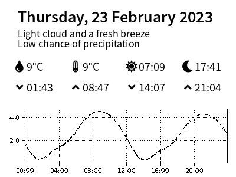

# tidetimes
A simple Python script that updates a [Pimoroni Inky wHAT](https://shop.pimoroni.com/products/inky-what?variant=13590497624147) with the local sea and weather information. The eInk screen has been placed in a little picture frame on the mantel piece.
## What is shown?

 - The current date
 - A short forecast for the day
 - The sea and air temperture
 - Sunrise and sunset times
 - The tide high and lows
 - And a nice graph, showing the rise and fall of the tides

## What does it look like

## How does it work?
The script uses Requests to do web scraping. It pulls data from the BBC (for the [weather forecast](https://www.bbc.co.uk/weather/), and the [tide times](https://www.bbc.co.uk/weather/coast-and-sea/tide-tables/) - where the graph comes from), and also from [Storm Glass](https://www.stormglass.io/) (for the sea temperatures.) It then creates an image and displays it on the eInk screen. 

It is designed to run every day in a cronjob. Run it in the morning, to see the tides and temperatures for the day. :)

## How do I make it work?
The code is very thrown together. :) It is written for me, you *will* need to make changes. If nothing else, you'll need to edit the URLs to change the locations so the weather is right. :)  You will also need to sign up to Storm Glass, and use their free (10 requests a day) API. (Storm Glass gives some other interesting information, including wave height and more, but this isn't used right now.)

One day I may refactor it, but today is not that day. Use it as a starting point.